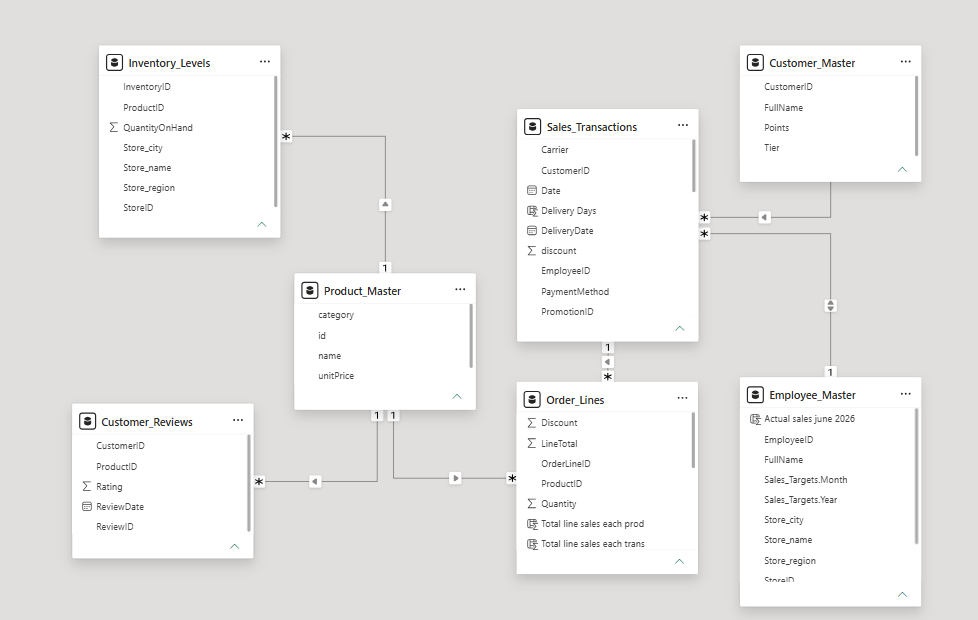
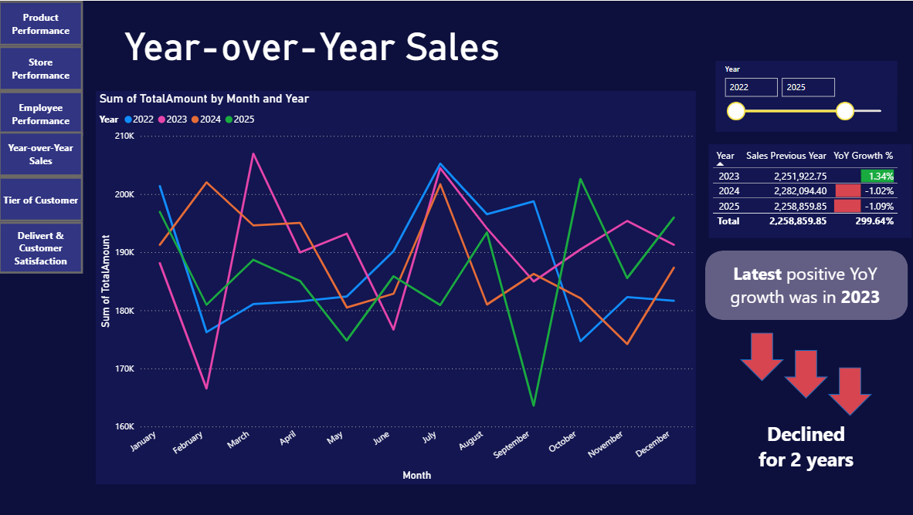
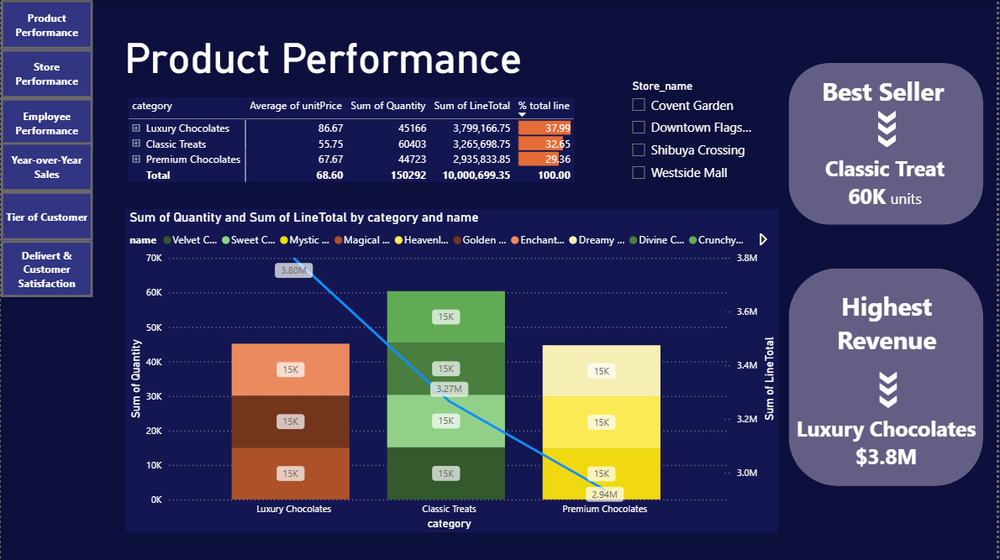
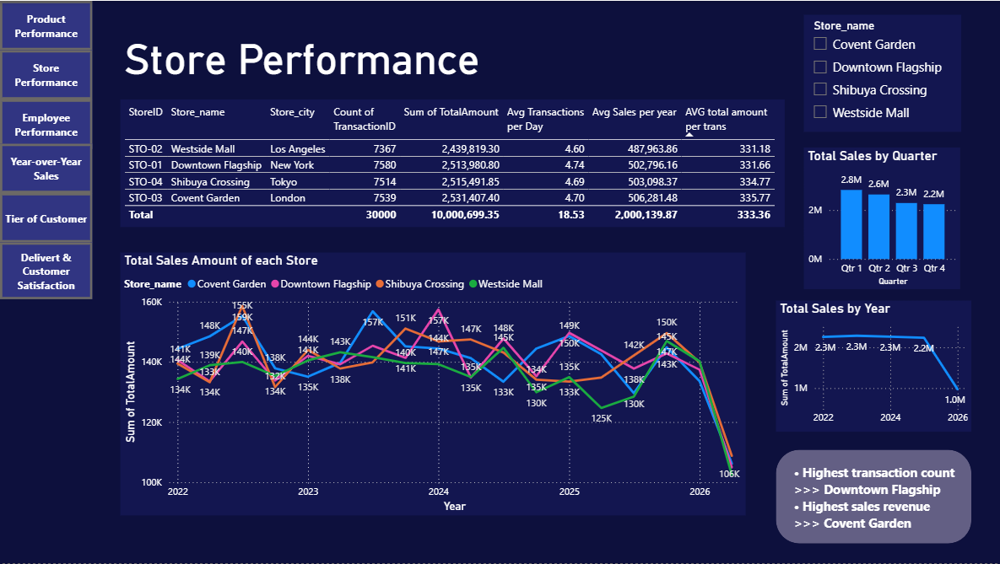
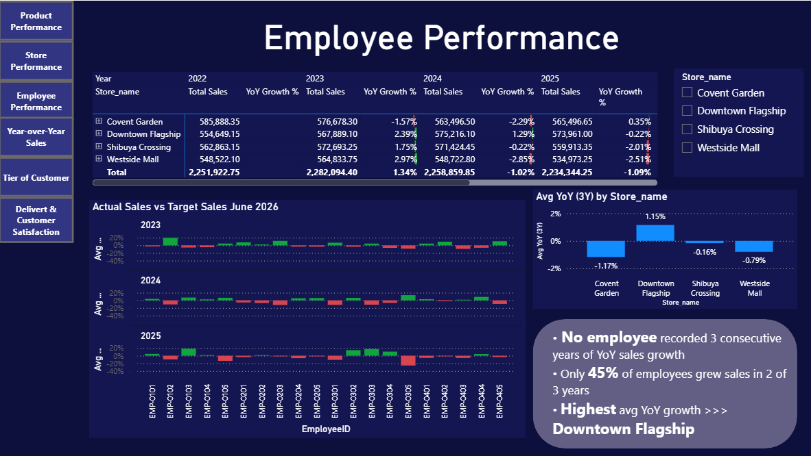

# Sales-Store-Dashboard
Interactive dashboards developed during my internship at EXIM Bank.

## Overview
This project focuses on developing interactive Power BI dashboards to monitor sales performance, evaluate employee KPIs, and analyze store operations. The dashboards provide insights into sales trends, product performance, store performance, customer segments, and customer satisfaction to support business reporting and performance monitoring.

## Tool
- PowerBI
- DAX
- Power Query

## Dataset
- Customer_Master
- Customer_Review
- Employee_Master
- Inventory_Levels
- Order_Lines
- Product_Master
- Sales_Transaction

## Data Preparation
- Data Cleaning
- Data Type Conversion
- Query Merging
- Data Tranformation

## Data Modeling

## Dashboard Pages
- YOY Sales

  

     > This dashboard enables users to compare sales performance across periods and monitor sales growth trends over time.
  

- Product Performance
  
  

     > This dashboard helps identify top-performing product's category and monitor product contributions to overall sales.
  
  
- Store Performance

  

     > This dashboard enables users to evaluate store performance and compare sales results across different locations.
  
  
- Employee Performance

  

     > This dashboard tracks employee KPIs to support performance evaluation and identify high-performing employees.
  

### Other dashboard pages :  
- Tier of Customer
- Delivery & Customer Satisfaction
 
